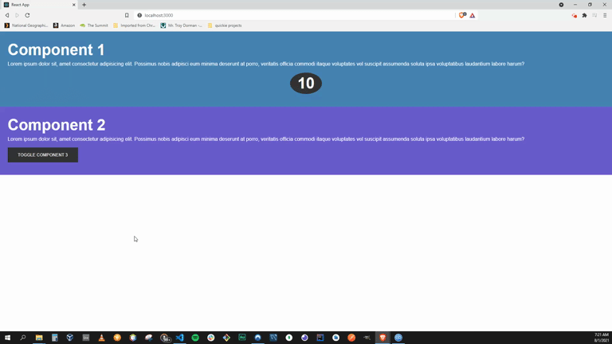

# REACT - Simple Animations w/React Spring

### About

utilizing the React Spring library, we create some simple animations within our React application. Initially, our first component slides in from off the screen, then we create a simple 10 second count up from 0 to 10, with a ten second duration to simulate a real time counting effect. Next, our second component appears with a toggle button which animates the appearance of our third component.

